# VRCLens as a VRCFury Prefab

**Convert VRCLens to a drag-n-drop VRCFury prefab**

VRCLens directly modifies your avatar's FX controller, menu, and parameters, making it hard to share or have different versions of your avatar with/without VRCLens.

As a VRCFury prefab, VRCLens can be set up once, then drag-n-drop'd to different avatar versions, and then be easily deleted :D

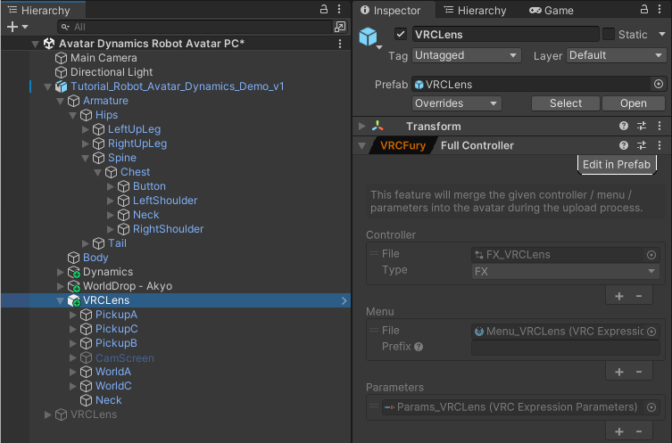

**Last updated:**

- 2026-05-19: Added compatibility note for AvatarPoseSystem
- 2025-02-09: Added steps to get Drone Track Self working (see step 12)
- 2025-01-16 for VRCLens 1.9.2

## Requirements

- **VRCFury**: https://vrcfury.com/
- **VRCLens**

## How to do it

1. In your **Project** files, create a new folder under **Assets** to store files for the VRCFury prefab. Or use an existing folder. I just made a new folder called "VRCLens"

   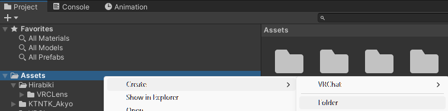

2. Right-click inside the folder and **Create** a new **VRChat > Expressions Parameters**, **VRChat > Expressions Menu**, and **Animator Controller**. Give them good names like `FX_VRCLens`, `Menu_VRCLens`, `Params_VRCLens`

   a. Create the Expression Parameters and Menu

   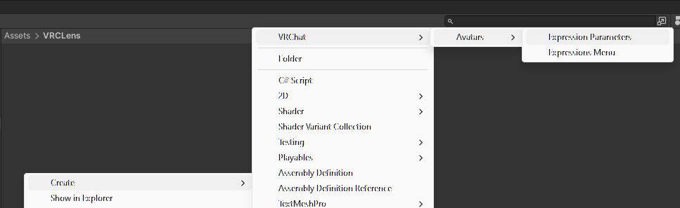

   b. Create the Animator Controller

   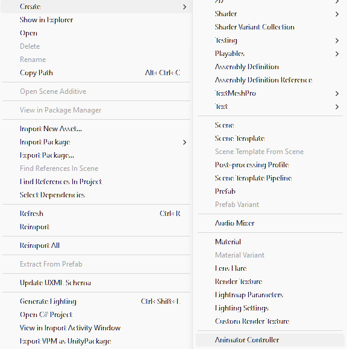

   c. Double-click the parameters and delete the `VRCEmote` parameter with the **Minus** button, as it won't be used. The other two parameters should be kept though.

   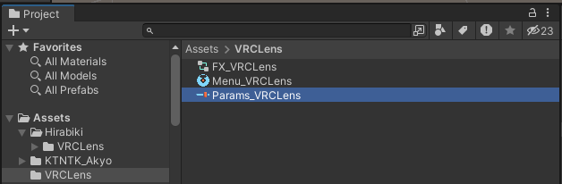

   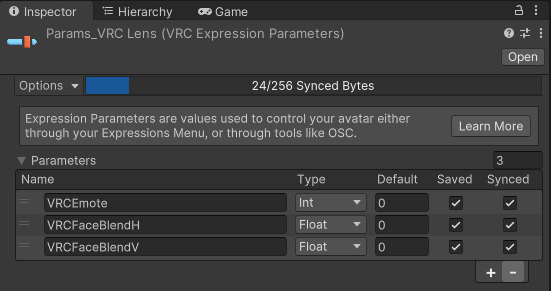

3. Temporarily replace your avatar's **FX** layer, **Expressions Menu**, and **Expressions Parameters** with the new files. Remember what the original FX layer, menu, and params were, as you'll have to swap them back in at the end.

   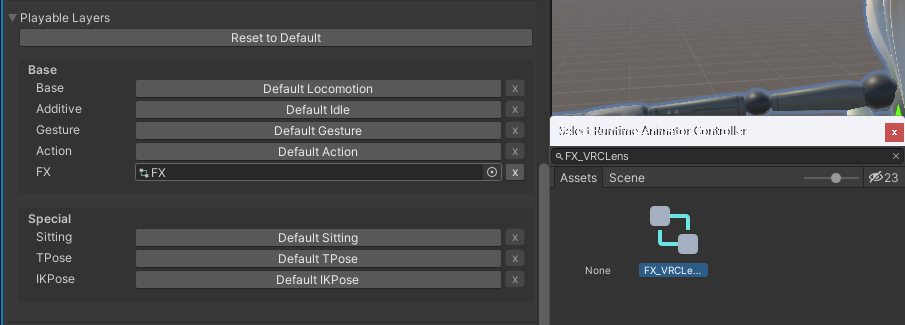

   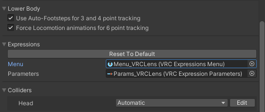

4. Install VRCLens onto your avatar as usual using the VRCLens installer. Auto-arrange the camera positions, change your settings, then **Apply VRCLens**. VRCLens will then modify the new separate FX/menu/params instead of your original avatar's

   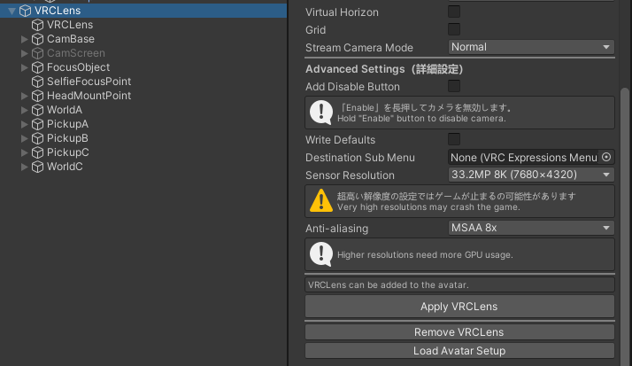

5. On the `VRCLens` object on your avatar, click **Add Component** and add a `Full Controller (VRCFury)`

   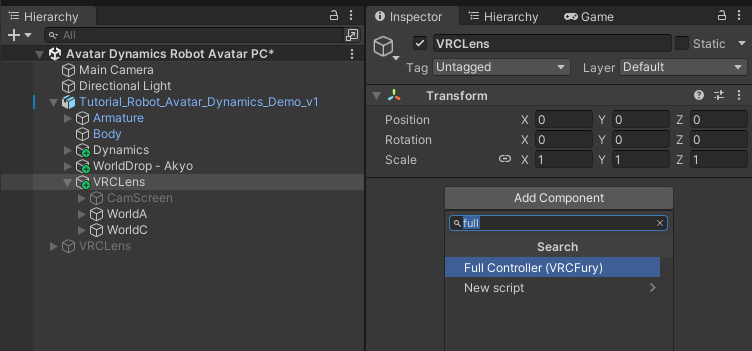

6. On the **Full Controller**, click the **Plus** button on the **Controller**, **Menu**, and **Parameters**, and place the new FX controller, menu, and parameters there

   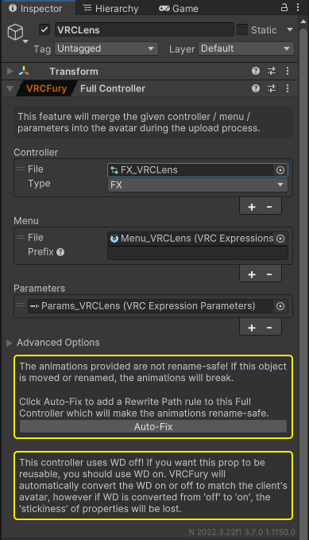

   a. Click the **Advanced Options** arrow. Under **Path Rewrite Rules**, type `VRCLens` under **If animated path has this prefix**. Leave the other settings alone. In newer VRCFury versions, there is an **Auto-Fix** button that will do the same thing, so you can just click that if you have it.

   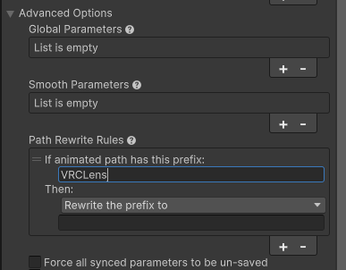

   b. Add **Global Parameters** and set it to `*` to make all VRCLens parameters global. This is optional in most cases though, and only necessary if you want to use VRCLens with OSC extensions or other mods.

   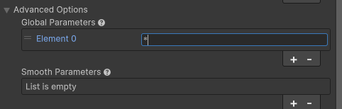

7. Restore the original **FX** layer, **Expressions Menu**, and **Expressions Parameters** on your avatar. If you just wanted to add VRCLens to a single avatar and keep the animator separate, you can stop here and not make the prefab. Otherwise, move on...

   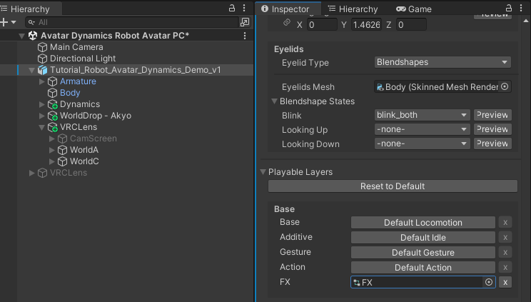

   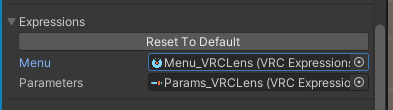

8. VRCLens puts 3 objects in your avatar armature: `PickupC` on the **Head**, `PickupA` on the **Right Hand**, and `PickupB` on the **Left Hand**. These need to be moved to the prefab.

   **Note**: The left and right hand objects will be swapped if you installed VRCLens on your left hand instead.

   a. Expand your **Armature**, find all 3 objects, and `Ctrl + Click` to select them all

   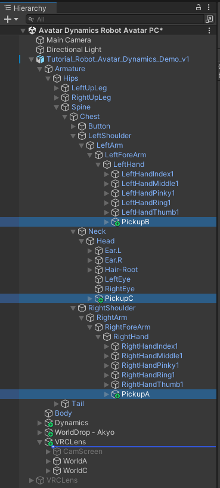

   b. Drag them to be directly under the `VRCLens` object instead

   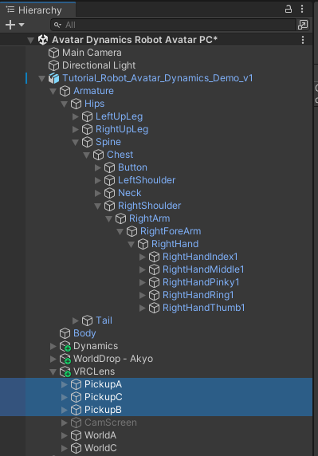

9. On `PickupC`, add an `Armature Link (VRCFury)` component.

   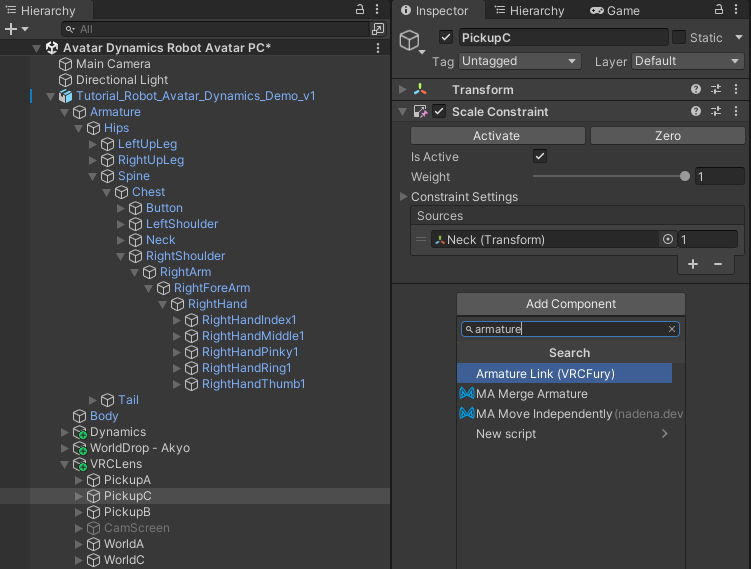

   a. Set **Link To (Avatar)** to `Head`

   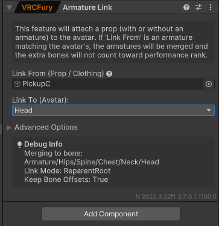

   b. `PickupC` also has a **Scale Constraint** on your avatar neck that's specific to this particular avatar. Right click the `VRCLens` object, and select **Create Empty** to create a new object. Name it `Neck`.

   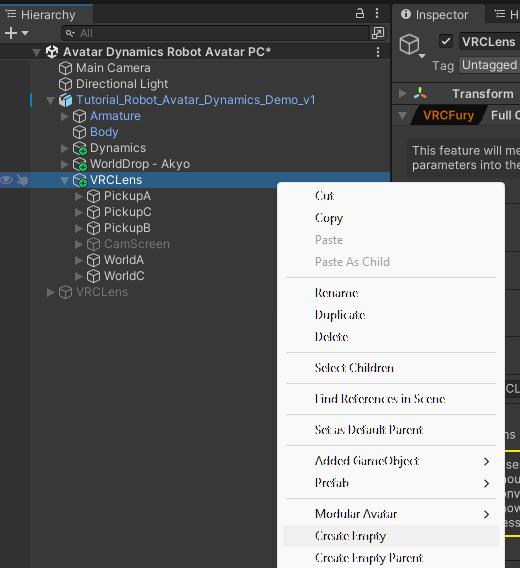

   c. Click the new `Neck` object and add an `Armature Link (VRCFury)` component, with **Link To (Avatar)** set to `Neck`

   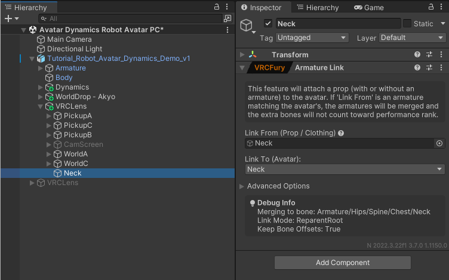

   d. Go back to `PickupC`, and drag the `Neck` object into the **Scale Constraint** source

   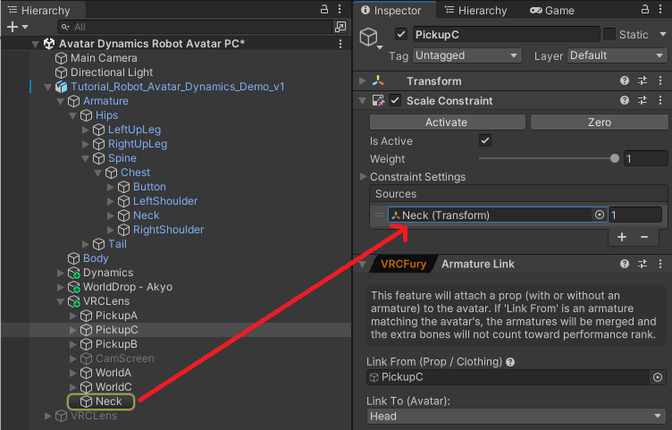

10. On `PickupA`, add an `Armature Link (VRCFury)` component, with **Link To (Avatar)** set to your main hand, `Right Hand` by default. If you installed VRCLens to your left hand, use `Left Hand` instead.

    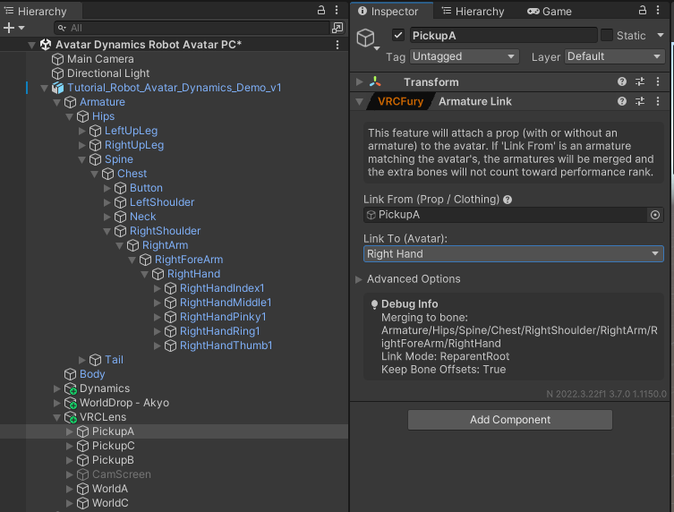

11. On `PickupB`, add an `Armature Link (VRCFury)` component, with **Link To (Avatar)** set to your other hand, `Left Hand` by default. If you installed VRCLens to your left hand, use `Right Hand` instead.

    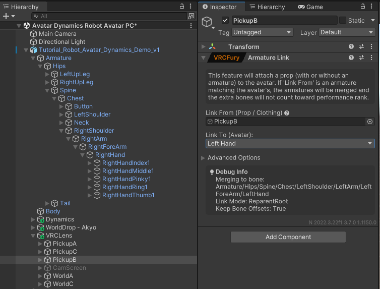

12. **Optionally**, if you use the **Drone Track Self** feature, the `VRCLens > WorldC > LookAtC` object has constraints on your avatar's **Hips**, **Left Foot**, and **Right Foot** that need to be moved to the prefab for Track Self features to work. You can ignore this if you don't use the Track Self feature.

    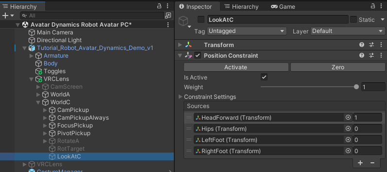

    a. Right click the `VRCLens` object, and select **Create Empty** to create a new object. Name it `Hips`. Repeat this two more times to create new objects for `Left Foot` and `Right Foot`. On each object, add an `Armature Link (VRCFury)` component, with **Link To (Avatar)** set to the corresponding body part, `Hips`, `Left Foot`, or `Right Foot`.

    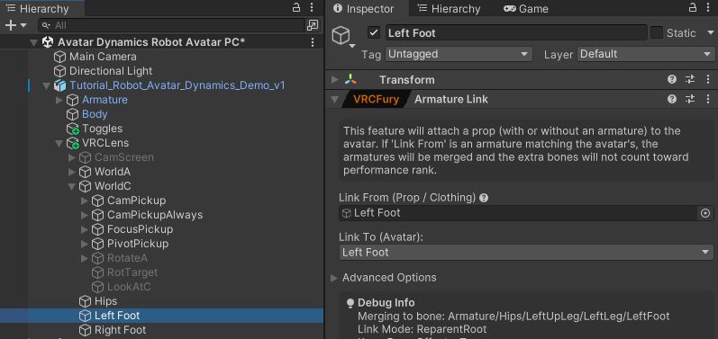

    b. In the `LookAtC` constraint sources, replace the 2nd, 3rd, and 4th slots with the `Hips`, `Left Foot`, and `Right Foot` objects you just created.

    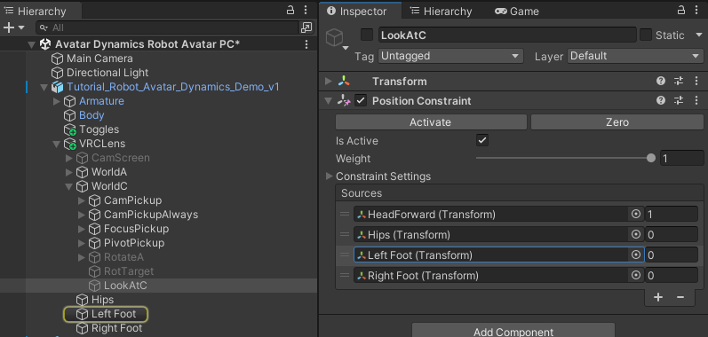

13. Drag the `VRCLens` object into your **Project** files to create a prefab out of it. It should now be blue in the **Hierarchy**. And it's done, now you can drag/copy the prefab onto any other avatar version to add VRCLens

    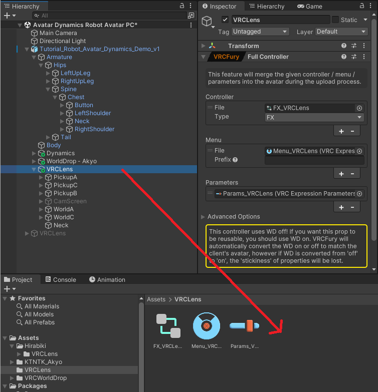

    

    a. To install the prefab onto other avatars, drag and drop the VRCLens prefab onto the avatar, and it's ready to upload

    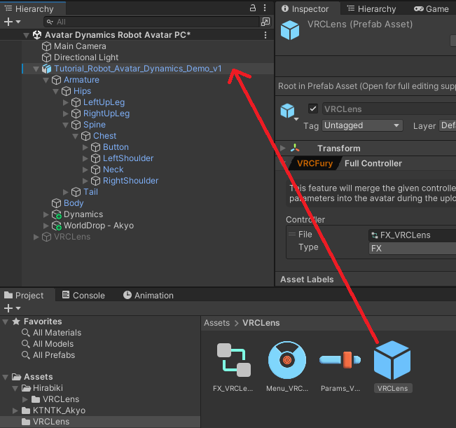

14. Repeat the steps if you want to change VRCLens settings, create a prefab for an entirely different avatar, or upgrade VRCLens. You can also make different VRCLens prefabs with different settings if you want.

## Compatibility: AvatarPoseSystem (Unfix Objects)

If you use AvatarPoseSystem (APS) with VRCLens, APS's `Unfix Objects` does not work with VRCFury `Armature Link` and the camera will stay on your avatar when you freeze a pose.

**To fix this:** Replace all VRCFury `Armature Link` components with Modular Avatar's `MA Bone Proxy` (`As child; keep position and rotation`) instead. Then add the VRCLens prefab to APS's `Unfix Objects` list. Everything else should stay the same.
