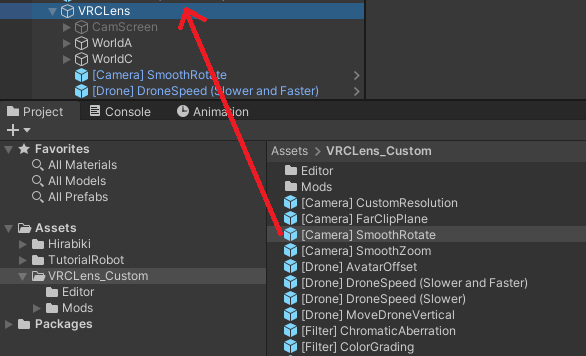

# VRCLens Add-ons

[VRCLens by Hirabiki](https://hirabiki.gumroad.com/l/rpnel) 用のカメラフィルターおよびQoLアドオン集。

[**最新バージョンをダウンロード**](https://github.com/gummidot/VRCLens-Addons/releases/latest) | [English (英語)](README.md)

Hashtag / ハッシュタグ: #GhostLens #VRCLens

> [!NOTE]
> **v1.xからアップグレードする場合:** v2.0でフォルダ構造が変更されました。`Assets/VRCLens_Custom` フォルダを丸ごと削除してから、新しいパッケージを再インポートしてください。その後、Prefab をアバターにドラッグし直してください。

## インストール

各アドオンはVRCFury Prefabで、既存のVRCLensにドラッグ＆ドロップするだけで導入できます。好きなものを選んで、いつでも追加・削除可能。VRCLens本体は一切変更しません。すべてのアドオンはローカル専用で、Expression Parametersの同期メモリを消費しません。

1. まず [VRCLens](https://hirabiki.gumroad.com/l/rpnel) をアバターにインストールしてください。
1. [VRCFury](https://vrcfury.com/download) がインストールされていることを確認してください。
1. `VRCLens_Custom` Unity パッケージをインポートし、`Assets/VRCLens_Custom` フォルダを開いてください。
1. Prefab をアバターの `VRCLens` オブジェクトにドラッグ＆ドロップしてください。
   - **注意:** VRCLens を再適用すると、Prefab が消えるため、再度ドラッグする必要があります。



## 対応 VRCLens バージョン

> [!WARNING]
> これらは VRCLens の非公式アドオンであり、VRCLens のアップデートにより動作しなくなる場合があります。記載のないバージョンでの動作は保証されません。

- **VRCLens 1.10.0**
- **VRCLens 1.9.2**

## アドオン一覧

**フィルター**

| Prefab | 説明 |
|--------|-------------|
| [Ghost Lens](#ghost-lens) | Prism Lens FX フィルターにインスパイアされたゴースト/モーションブラーフィルター *(有料、[Booth](https://gummidot.booth.pm/items/8375173))* |
| [Fisheye Lens](#fisheye-lens) | 魚眼レンズの歪み |
| [Chromatic Aberration](#chromatic-aberration) | 色収差エフェクト |
| [Color Grading](#color-grading) | シャドウ/ミッドトーン/ハイライトの色調整とブライトネス |
| [Film Grain](#film-grain) | フィルムグレインオーバーレイエフェクト |
| [Vignette](#vignette) | 画面端を暗くするビネットエフェクト |
| [Letterbox](#letterbox) | レターボックス/ピラーボックスのアスペクト比プリセット |
| [Depth Fog](#depth-fog) | シーンの奥行きに基づく大気フォグ |
| [Tilt-Shift](#tilt-shift) | チルトシフト・ミニチュア被写界深度 |
| [Pixelation](#pixelation) | レトロピクセル化エフェクト |
| [Swirly Bokeh](#swirly-bokeh) | 渦巻きボケエフェクト |
<!-- | [Soft Glow](#soft-glow) | ディフュージョングローフィルター | -->

**カメラ**

| Prefab | 説明 |
|--------|-------------|
| [Smooth Rotate](#smooth-rotate) | カメラの動きをスムーズに |
| [Smooth Zoom](#smooth-zoom) | ズームスライダーに軽いスムージングを追加 |
| [Custom Resolution](#custom-resolution) | カメラ解像度とアンチエイリアスを上書き |
| [Far Clip Plane](#far-clip-plane) | カメラの遠クリッピング面を拡張 |
| [Player Visibility](#player-visibility) | VRCLensから他プレイヤーや自分を非表示化 |

**ドローン**

| Prefab | 説明 |
|--------|-------------|
| [Drone Speed](#drone-speed) | ドローン速度スライダーをデフォルトより遅く/速く調整 |
| [Move Drone Vertical](#move-drone-vertical) | ドローンを垂直に移動するパペットメニュー |
| [Avatar Offset](#avatar-offset) | 手動操作を維持しながらアバターからカメラをオフセット |

**フォーカス**

| Prefab | 説明 |
|--------|-------------|
| [Manual Focus (9m)](#manual-focus-9m) | Manual Focus スライダーを9mに制限 |
| [Manual Focus (0.1m to 9m)](#manual-focus-01m-to-9m) | マニュアルフォーカスの最短距離を0.1mに拡張 |
| [Manual Focus Assist](#manual-focus-assist) | フォーカスポイント付近のアバターのぼかしを軽減 |
| [Max Blur Size](#max-blur-size) | パフォーマンス向上のため最大ぼかしサイズを調整 |

**ユーティリティ**

| Prefab | 説明 |
|--------|-------------|
| [Preset Saver](#preset-saver) | カスタムアドオン設定のプリセットを最大 6 つ保存 |
| [Fix Avatar Drop](#fix-avatar-drop) | VRCLens 1.9.1以降で動作しなくなった Avatar Drop を修正 |
| [VRCLens Optimizer](#vrclens-optimizer) | VRCLens のオプションコンポーネントを削除 |
| [Menu Extra](#menu-extra) | その他メニューの細かな改善 |

---

## フィルター

### Ghost Lens

> [!NOTE]
> Ghost Lens は有料アドオンで、[Booth](https://gummidot.booth.pm/items/8375173) で販売しています。その他のアドオンはすべて無料です。

**[Prism Lens FX](https://prismlensfx.com/) フィルターにインスパイアされたゴースト/モーションブラーフィルター**

実物のレンズフィルターによるゴースト/モーションブラー効果を再現し、半透明でズレた残像を作り出します。Splitモードは画面の片側に一方向のゴーストを描画します。Dualモードは両側から二重のゴーストを発生させ、中央に配置した被写体には影響を与えません。角度は360度自由に回転可能です。

#### 使い方

操作メニューは `VRCLens/Custom/Ghost Lens` にあり、ゴーストモード、ブレンドモード、フォーカスゾーン、エフェクト、詳細設定のサブメニューがあります。

<video src="https://github.com/user-attachments/assets/0f83f620-a3e5-4e0f-a0ef-57fcc2505714"></video>

| 設定 | 範囲 | デフォルト | 説明 |
|---|---|---|---|
| Enable | On / Off | Off | ゴーストエフェクトを有効にする。 |

Ghost Mode サブメニュー:

| 設定 | 範囲 | デフォルト | 説明 |
|---|---|---|---|
| Split Ghost | On / Off | Off | 半画面の単方向ゴーストモード。 |
| Dual Ghost | On / Off | Off | 中央クリアの二重ゴーストモード。 |
| Full Screen | On / Off | Off | ゾーンマスクをバイパスし、画面全体にゴーストを適用。 |
| Center Width (Dual) | 0% - 100% | 25% | Dual モードでのクリアな中央ゾーンの幅。 |

メインコントロール:

| 設定 | 範囲 | デフォルト | 説明 |
|---|---|---|---|
| Rotation | 0% - 100% | 50% | ゴーストの方向（0〜360度にマッピング）。 |
| Distance | 0% - 100% | 33% | ゴーストが元の位置からどれだけずれるか。 |
| Intensity | 0% - 100% | 50% | ゴーストの可視度。 |
| Smear | 0% - 100% | 25% | 方向性のあるストリーク/ブラーの量。 |

Blend Mode サブメニュー（相互排他トグル）:

| 設定 | デフォルト | 説明 |
|---|---|---|
| Lighten | On | ゴーストが元の画像より明るい部分のみ表示。実物のプリズムフィルターに最も近い。 |
| Normal | Off | 標準ブレンド。明るさに関係なくゴーストがすべてに重なる。 |
| Screen | Off | ハイライトを飛ばさずに明るくする。Additive よりソフトで、ドリーミーなグロウに最適。 |
| Additive | Off | ゴーストの光を上乗せする。ハイライトが飛ぶ場合がある。強い光漏れの見た目。 |
| Darken | Off | ゴーストが元の画像より暗い部分のみ表示。ムーディな影のようなゴースト。 |

Focus Zone サブメニュー:

| 設定 | 範囲 | デフォルト | 説明 |
|---|---|---|---|
| Enable | On / Off | Off | フォーカスポイント付近のみにゴーストを適用（被写体にゴースト）。DoF を有効にする必要はなく、VRCLens の Manual Focus を設定するだけで使用可能。 |
| Spread | 0% - 100% | 40% | エフェクトがフォーカスポイントからどの程度広がるか。低い値 = 狭いゾーン、高い値 = 広いゾーン。 |
| Reverse | On / Off | Off | 反転: フォーカスされた被写体以外にゴーストを適用。 |
| Focus Distance | 0% - 100% | 0% | VRCLens の Manual Focus スライダーの便利な複製。Focus メニューに戻る手間を省きます。 |

Effects サブメニュー:

| 設定 | 範囲 | デフォルト | 説明 |
|---|---|---|---|
| Shake | | | 手持ちカメラの手ぶれサブメニュー。 |
| Shimmer | 0% - 100% | 0% | 時間経過によるランダムなドリフト。 |
| Chroma | 0% - 100% | 0% | ゴースト反射のクロマティックカラースプリット。[Chromatic Aberration](#chromatic-aberration) と違い、ゴースト自体にのみ影響。 |

Shake サブメニュー:

| 設定 | 範囲 | デフォルト | 説明 |
|---|---|---|---|
| Intensity | 0% - 100% | 0% | 手ぶれの強さ。 |
| Speed | 0% - 100% | 30% | 手ぶれアニメーションの速度。 |
| Distance | 0% - 100% | 0% | 手ぶれがゴーストを動かす距離。 |

Advanced サブメニュー:

| 設定 | 範囲 | デフォルト | 説明 |
|---|---|---|---|
| Smear Width | 0% - 100% | 25% | 方向性ストリークの幅。 |
| Layers | 0% - 100% | 0% | トレイル距離の乗数（1〜5レイヤー）。 |
| Edge Smoothing | 0% - 100% | 30% | 画面端のゴーストエフェクトをフェードアウトさせ、端のストリーキングを防止。高い値ほどきれいな端になるが、ゴーストが控えめになる。 |

> [!NOTE]
> Ghost Lens は他のフィルターよりGPU負荷が高くなります。特にスミアやレイヤーの値が高い場合、FPSが低下することがあります。

### Fisheye Lens

**魚眼レンズの歪み**

中央を外側に膨らませ、端に向かって歪みが増す魚眼レンズのディストーション。楕円クロップ、エッジソフトネス、逆方向（ピンクッション）モードを含みます。

> [!NOTE]
> これは画面上の既存のピクセルをリマップするポストプロセスフィルターです。より本格的な魚眼効果には、[Flex FishEye Lens](https://goat-cannery.booth.pm/items/5512392) をご検討ください。

#### 使い方

操作メニューは `VRCLens/Custom/Fisheye Lens` にあります。

<video src="https://github.com/user-attachments/assets/86af8b33-2abd-486b-bcd8-9e591daf1eb7"></video>

| 設定 | 範囲 | デフォルト | 説明 |
|---|---|---|---|
| Enable | On / Off | Off | エフェクトの有効/無効を切り替え。 |
| Strength | 0% - 100% | 12% | 魚眼ディストーションの量。 |
| Roundness | 0% - 100% | 0% | 0% = 画面いっぱいの楕円、100% = 真円。 |
| Lens Size | 0% - 100% | 65% | 楕円クロップのサイズ。高い値でクロップが完全に隠れる（100%で歪んだ長方形がすべて見える）。 |
| Edge Softness | 0% - 100% | 0% | 端が黒にフェードする度合い。0% = ハードカットオフ。 |
| Reverse Fisheye | 0% - 100% | 0% | 逆方向の魚眼ディストーション。有効時は Strength を上書き。 |
| Center X | 0% - 100% | 50% | ディストーション中心を左右に移動。 |
| Center Y | 0% - 100% | 50% | ディストーション中心を上下に移動。 |

### Chromatic Aberration

**色収差（カラーフリンジング）エフェクト**

横色収差は画面端に向かって増加する放射状のカラーフリンジングを生成します。軸上色収差はピントの合っていない領域に深度に応じたカラーフリンジングを生成します。両方を同時に使用できます。

#### 使い方

スライダーはメニューの `VRCLens/Custom/Chromatic Aberration` にあります。

<video src="https://github.com/user-attachments/assets/018d75ee-fefd-4c83-a3c3-8f048995cdd9"></video>

| 設定 | 範囲 | デフォルト | 説明 |
|---|---|---|---|
| Enable | On / Off | Off | エフェクトの有効/無効を切り替え。 |
| Transverse CA | 0% - 100% | 0% | 画面端に向かうカラーフリンジング。 |
| Axial CA | 0% - 100% | 0% | ピントの合っていない領域のカラーフリンジング。 |

Axial Focus-Aware サブメニュー:

| 設定 | 範囲 | デフォルト | 説明 |
|---|---|---|---|
| Enabled | On / Off | On | フォーカスゾーンの Axial CA を軽減し、シャープな被写体をクリーンに保つ。 |
| Magenta-Green | On / Off | Off | 赤/青フリンジングとマゼンタ/緑フリンジングを切り替え。 |

### Color Grading

**シャドウ/ミッドトーン/ハイライトの色調整、ブライトネス、サチュレーション、バイブランス、コントラスト付き**

グローバルなサチュレーション、バイブランス、コントラスト。さらにシャドウ、ミッドトーン、ハイライトごとのブライトネス、色温度、RGBシフト。

#### 使い方

操作メニューは `VRCLens/Custom/Color Grading` にあり、各ゾーンのサブメニューがあります。

<video src="https://github.com/user-attachments/assets/5fd955e0-21af-4cb9-97e0-a28246fb1d1c"></video>

| 設定 | 範囲 | デフォルト | 説明 |
|---|---|---|---|
| Enable | On / Off | Off | エフェクトの有効/無効を切り替え。 |
| Saturation | 0% - 100% | 50% | 色の強度。50% = 変化なし、0% = 低彩度、100% = 過飽和。 |
| Vibrance | 0% - 100% | 0% | 肌の色を過飽和にせず、控えめな色を引き立てる。 |
| Contrast | 0% - 100% | 50% | 50% = 変化なし、0% = 低コントラスト、100% = 高コントラスト。 |

ゾーンごとのコントロール（Shadows、Midtones、Highlights サブメニュー）:

| 設定 | 範囲 | デフォルト | 説明 |
|---|---|---|---|
| Brightness | 0% - 100% | 50% | 50% = 変化なし、0% = 暗く、100% = 明るく。 |
| Temperature | 0% - 100% | 50% | 0% = 寒色/青、50% = ニュートラル、100% = 暖色/オレンジ。 |
| R / G / B | 0% - 100% | 50% | 個別の色調整。50% = ニュートラル。 |

| 設定 | 説明 |
|---|---|
| Reset | すべての Color Grading パラメータをデフォルトにリセット。 |

### Film Grain

**アナログフィルムグレインオーバーレイ**

照明に動的にブレンドされる動くフィルムグレインで、端に向かってテクスチャが強くなります。

#### 使い方

操作メニューは `VRCLens/Custom/Film Grain` にあります。

<video src="https://github.com/user-attachments/assets/9cc01bf0-5067-40e7-a414-5d75af831021"></video>

| 設定 | 範囲 | デフォルト | 説明 |
|---|---|---|---|
| Enable | On / Off | Off | エフェクトの有効/無効を切り替え。 |
| Intensity | 0% - 100% | 25% | グレインの量。0% = オフ。 |
| Size | 0% - 100% | 0% | グレイン粒子のサイズ。0% = 細かい（約1.5px）、100% = 粗い（約4px）。 |
| Brightness | 0% - 100% | 50% | グレインの明るさバイアス。50%以下で暗く、50%以上で明るくなる。 |
| Speed | 0% - 100% | 50% | アニメーション速度。0% = 静止、100% = 速い。 |

### Vignette

**調整可能なシェイプとソフトネスのビネットエフェクト**

中央を明るく保ちながら画面端を黒に暗くします。シェイプは楕円（画面アスペクト比に従う）から真円に変形できます。

#### 使い方

操作メニューは `VRCLens/Custom/Vignette` にあります。

<video src="https://github.com/user-attachments/assets/b1297efe-c6c0-4737-8509-7bc3541ad93d"></video>

| 設定 | 範囲 | デフォルト | 説明 |
|---|---|---|---|
| Enable | On / Off | Off | エフェクトの有効/無効を切り替え。 |
| Strength | 0% - 100% | 25% | 端の暗さの強度。 |
| Radius | 0% - 100% | 80% | 中心からどの距離で暗くなり始めるか。 |
| Softness | 0% - 100% | 50% | フェードの滑らかさ。低い値 = シャープな境界、高い値 = なめらかなフェード。 |
| Roundness | 0% - 100% | 0% | 0% = 楕円、100% = 真円。 |

### Letterbox

**選択可能なアスペクト比のシネマティックな黒帯**

構図を決めながら最終的にクロップされるフレームをプレビューするための水平または垂直の黒帯を追加します。後処理でクロップせずに、さまざまなアスペクト比で構図を検討するのに便利です。

#### 使い方

トグルはメニューの `VRCLens/Custom/Letterbox` にあります。アスペクト比は1つずつ選択してください（相互排他）。

<video src="https://github.com/user-attachments/assets/b6c0dac6-36c1-4ffe-8b58-a96471532293"></video>

| アスペクト比 | 用途 |
|---|---|
| 2.39:1 | シネマスコープ |
| 2.35:1 | アナモルフィック |
| 2.00:1 | ユニビジウム |
| 1.85:1 | シアトリカル |
| 16:9 | ワイドスクリーン |
| 3:2 | DSLR |
| 4:3 | クラシック |
| 1:1 | スクエア |
| 4:5 | ポートレート |
| 9:16 | 縦型 |

### Depth Fog

**シーンの奥行きに基づく大気フォグ**

距離に応じてフェードインするフォグを追加します。前景はクリアなまま、背景がヘイズに溶け込みます。

#### 使い方

操作メニューは `VRCLens/Custom/Depth Fog` にあります。

<video src="https://github.com/user-attachments/assets/8ded729e-0975-41d8-8cbf-9b7ac44d13c3"></video>

| 設定 | 範囲 | デフォルト | 説明 |
|---|---|---|---|
| Enable | On / Off | Off | エフェクトの有効/無効を切り替え。 |
| Density | 0% - 100% | 17% | フォグの濃さ。 |
| Start Distance | 0% - 100% | 0% | フォグが始まる距離（0〜500mにマッピング）。 |
| Color R / G / B | 0% - 100% | 各70% | フォグの色。デフォルトはニュートラルグレー。 |

### Tilt-Shift

**チルトシフト・ミニチュア被写界深度エフェクト**

実物大のシーンをミニチュア模型のように見せる選択的フォーカス。2つのモードがあります:

- **2D Mode（デフォルト）** -- 画面の上下をぼかし、中央にシャープなストライプを残します。多くのフォトエディターのチルトシフトと同様の動作です。空撮の街並みのような平面的なシーンに最適。
- **Depth Mode** -- ピントの合う範囲が、画面上の位置ではなくカメラからの距離に基づきます。タワーのような背の高いオブジェクトは根元から頂上までシャープに保たれます。VRCLens の Manual Focus またはオートフォーカスに連動します。背の高い建物や木のあるシーンに最適。

#### 使い方

操作メニューは `VRCLens/Custom/Tilt-Shift` にあります。

<video src="https://github.com/user-attachments/assets/ebe84eef-8db9-400b-a09d-6c058c6c7e61"></video>

| 設定 | 範囲 | デフォルト | 説明 |
|---|---|---|---|
| Enable | On / Off | Off | エフェクトの有効/無効を切り替え。 |
| Depth Mode | On / Off | Off | Off = 画面上のシャープネスストライプ、On = 実際の距離に基づくシャープネス。 |
| Blur | 0% - 100% | 25% | シャープエリア外のぼかしの強さ。両モード共通。 |

**2D Mode コントロール**

| 設定 | 範囲 | デフォルト | 説明 |
|---|---|---|---|
| Position | 0% - 100% | 50% | シャープストライプの画面上の位置。0% = 下端、50% = 中央、100% = 上端。 |
| Width | 0% - 100% | 50% | シャープストライプの太さ。 |
| Angle | 0% - 100% | 50% | シャープストライプの回転。50% = 水平。斜めや垂直のフォーカスラインに調整可能。 |

**Depth Mode コントロール**

| 設定 | 範囲 | デフォルト | 説明 |
|---|---|---|---|
| Position | 0% - 100% | 50% | シャープエリアを VRCLens のフォーカスポイントから近づけるか遠ざけるか。50% = オフセットなし、0% = 手前に引く（約50m）、100% = 奥に押す（約50m）。 |
| Width | 0% - 100% | 50% | シャープエリアの深さ。距離に応じてスケールするため、小さい値で薄いスライス、大きい値でより多くのシーンがシャープに。 |
| Angle | 0% - 100% | 50% | シャープエリアを傾けて、フレーム内で手前から奥にかけてフォーカスを変化させる。50% = 傾きなし（通常の被写界深度）、50%以下 = 画面上部が手前にフォーカス（見下ろすショットに最適）、50%以上 = 画面上部が奥にフォーカス（見上げるショットに最適）。 |

### Pixelation

**レトロピクセル化エフェクト**

画像をブロック状にピクセル化し、低解像度のレトロな見た目にします。

#### 使い方

操作メニューは `VRCLens/Custom/Pixelation` にあります。

<video src="https://github.com/user-attachments/assets/933e8cc9-a9c3-47b6-a80a-162d915a7303"></video>

| 設定 | 範囲 | デフォルト | 説明 |
|---|---|---|---|
| Enable | On / Off | Off | エフェクトの有効/無効を切り替え。 |
| Block Size | 0% - 100% | 30% | ピクセルブロックのサイズ。0% = 小さい（2px）、100% = 大きい（64px）。 |
| Dither | 0% - 100% | 0% | ディザリングパターンを追加。Posterizeと併用で色段差を滑らかに、単独でスクリーンドア風テクスチャを追加。 |
| Posterize | 0% - 100% | 0% | 色数を削減。0% = フルカラー、100% = 大幅に削減。 |
| Aspect Ratio | 0% - 100% | 50% | ピクセルブロックの形状。0% = 横長、50% = 正方形、100% = 縦長。 |

### Swirly Bokeh

> [!NOTE]
> アーリープレビュー：現在は[Ghost Lensパッケージ](https://gummidot.booth.pm/items/8375173)にのみ同梱されています。今後のアップデートで無料ベースパッケージに移行する場合があります。

**渦巻きボケエフェクト**

一部のヴィンテージレンズに見られるボケの渦巻き効果を再現します。DoF有効時、背景のぼかしがフレームの端に向かって渦を巻くような形になります。

#### 使い方

操作メニューは `VRCLens/Custom/Swirly Bokeh` にあります。

<video src="https://github.com/user-attachments/assets/505fc136-c2c5-47e5-9f0c-fd7a06ebad4c"></video>

| 設定 | 範囲 | デフォルト | 説明 |
|---|---|---|---|
| Enable | On / Off | Off | エフェクトの有効/無効を切り替え。 |
| Strength | 0% - 100% | 70% | 渦巻きの強さ。 |
| Radius | 0% - 100% | 80% | フレームのどの範囲まで影響するか。高いほど中央寄りから渦巻きが始まる。 |

<!--
### Soft Glow

**ディフュージョングローフィルター**

細部を柔らかくし、明るい部分を外側ににじませます。フォーカスゾーンを有効にすると、ピントが合った被写体のみ（または背景のみ）にエフェクトを適用できます。

#### 使い方

操作メニューは `VRCLens/Custom/Soft Glow` にあります。

| 設定 | 範囲 | デフォルト | 説明 |
|---|---|---|---|
| Enable | On / Off | Off | エフェクトの有効/無効を切り替え。 |
| Strength | 0% - 100% | 35% | 明るい部分のグロウの強さ。 |
| Diffusion | 0% - 100% | 35% | ディテールをどれだけ柔らかくするか。 |
| Radius | 0% - 100% | 35% | エフェクトの広がり。 |

Focus Zone サブメニュー:

| 設定 | 範囲 | デフォルト | 説明 |
|---|---|---|---|
| Enable | On / Off | Off | フォーカスポイント付近のみにグローを適用（被写体にグロー）。DoF を有効にする必要はなく、VRCLens の Manual Focus を設定するだけで使用可能。 |
| Spread | 0% - 100% | 40% | エフェクトがフォーカスポイントからどの程度広がるか。低い値 = 狭いゾーン、高い値 = 広いゾーン。 |
| Reverse | On / Off | Off | 反転: フォーカスされた被写体以外にグローを適用。 |
-->

---

## カメラ

### Smooth Rotate

**カメラの動きをスムーズにするスライダーを追加**

デスクトップとVRの両方で動作し、OVR-SmoothTracking よりも強力にカメラの動きを滑らかに（スムージング）できます。

#### 使い方

スライダーはメニューの `VRCLens/Custom/Smooth Rotate` にあります。
0%が最小（デフォルト）のスムージングで、100%が最大のスムージングです。

これを動作させるには、Stabilize モード（白/黄色の手アイコン）をオンにしてください。

<video src="https://github.com/user-attachments/assets/05d5c2fd-28e6-4f38-8b98-11be5db84a1b"></video>

#### クレジット

やり方を解説してくれた [Minkis](https://www.youtube.com/watch?v=XMcTfFoNUHA) に感謝します。

### Smooth Zoom

**ズームスライダーに軽いスムージングを追加**

#### 使い方

標準のズームスライダーをいつも通り使ってください。

<video src="https://github.com/user-attachments/assets/b9be523d-e54e-4b8c-bd44-dd43ec843ce1"></video>

### Custom Resolution

**カメラ解像度とアンチエイリアスを上書き**

通常、センサー解像度とアンチエイリアスは VRCLens のインストール時にしか設定できません。このアドオンを使えば、VRCLens を再インストールしなくても解像度とアンチエイリアスを変更できます。

フル SBS 3D の実験的サポートも追加されます。VRCLens は現在サイドバイサイド3Dモードにハーフ SBS を使用しているため、1920x1080 で3D録画すると水平解像度が半分（片目あたり960x1080）の 1920x1080 映像になります。フル SBS なら 3840x1080 で録画し、フル解像度（片目あたり1920x1080）の 1920x1080 映像を生成できます。

#### 使い方

**Override Resolution** と **Override Anti-Aliasing** にカスタム解像度やアンチエイリアスを入力してください。

必要に応じて **Use Full SBS 3D (experimental)** をクリックして有効にしてください。その場合は、幅を2倍にした解像度に変更してください。


### Far Clip Plane

**カメラの遠クリッピング面を拡張**

一部のワールドでは、VRCLens の短い遠クリッピング面のせいで遠くのオブジェクトが消えてしまいます。
このアドオンは、遠クリッピング面を最大 `128000` まで上げるローカル専用スライダーを追加します。

#### 使い方

スライダーはメニューの `VRCLens/Custom/Far Clip Plane` にあります。

<video src="https://github.com/user-attachments/assets/bb43007a-006c-4075-aa23-1c9b4624e407"></video>

テストワールド: [Tulip Riverie...](https://vrchat.com/home/world/wrld_fcad2657-05c6-4226-ac5d-9cd1688beb74/info)、[Cycle of Life](https://vrchat.com/home/world/wrld_cd085851-4baf-4fb8-9a2a-e0e20f686502/info)

### Player Visibility

**VRCLensから他プレイヤーや自分を非表示化**

VRCLens に映るものを制御する2つの独立したトグル:

- **Hide Remote Players** は写真から他プレイヤーを除外します。
- **Hide Self** は写真から自分のアバターを除外します。

両方を同時に有効にすると、プレイヤーなしでワールドだけを撮影できます。

> [!NOTE]
> これはワールドのミラーや他プレイヤーの見え方には影響しません。

#### 使い方

トグルはメニューの `VRCLens/Custom/Player Visibility` にあります。

| 設定 | デフォルト | 説明 |
|---|---|---|
| Hide Remote Players | Off | VRCLens から他プレイヤーを非表示にする。 |
| Hide Self | Off | VRCLens から自分のアバターを非表示にする。 |

---

## ドローン

### Drone Speed

**ドローン速度スライダーをデフォルトより遅く/速く調整**

2つのバージョンがあります。アバターにはどちらか1つだけ追加してください:

- **Slower** はドローンをより遅く動かせるようにします。0%がゼロ速度になります。
- **Slower and Faster** はドローンをより遅く、またはより速く動かせるようにします。0%がゼロ速度、75%が元の最高速度、100%が元の最高速度の32倍になります。

#### 使い方

標準のドローン速度スライダーをいつも通り使ってください。

<video src="https://github.com/user-attachments/assets/672eee73-1523-4737-9267-767bda7d8efb"></video>

### Move Drone Vertical

**ドローンを垂直に移動するパペットメニューを追加**

通常、ドローンを垂直に動かすにはジェスチャーで前後移動と上下移動を切り替える必要があります。パペットメニューを使えば、ドローンをより簡単に垂直移動でき、前後と上下を同時に動かすこともできます。

#### 使い方

パペットメニューはメニューの `VRCLens/Custom/Move Drone Vertical` にあります。

<video src="https://github.com/user-attachments/assets/172956c2-84d5-4f11-9ad8-f93599b73564"></video>

### Avatar Offset

**手動操作を維持しながらアバターからカメラをオフセット**

Avatar Drop のようにアバターからカメラをオフセットしますが、手でカメラを動かし続けられます。自分よりも遠く、高く、または低い位置にミラーリングされた分身がいるような感覚です。

#### 使い方

メニューの `VRCLens/Custom/Avatar Offset` に3つのトグルがあります:

- **AvatarOffset** はアバターオフセットを有効にします。トグルしたら、ドローンでカメラを自分から離してください。
- **Rotate With Avatar** はカメラの回転をアバターの回転に連動させます。デフォルトでは、回転してもカメラはその場にとどまります。
- **Drop (Reset to Hand)** はカメラを手元に戻します。ドローンの Drop ボタンと同じ機能ですが、利便性のためにこちらのメニューにも配置しています。

<video src="https://github.com/user-attachments/assets/8cfbe8ca-1adb-4b94-802d-95cf99186c06"></video>

---

## フォーカス

### Manual Focus (9m)

**Manual Focus スライダーを9mに制限**

Manual Focus スライダーの最大値を9m（元のスライダーの50%）に制限します。ごく軽いスムージングも追加されます。短距離でのフォーカスをより細かく制御したい場合に使用してください。

#### 使い方

標準の Manual Focus スライダーをいつも通り使ってください。

<video src="https://github.com/user-attachments/assets/9f8496e8-8a36-44f0-b450-0b3474b765f4"></video>

### Manual Focus (0.1m to 9m)

**マニュアルフォーカスの最短距離をデフォルトの0.5mから0.1mに拡張**

VRCLens の設定を変更し、デフォルトの最小値0.5mよりも近くにピントを合わせられるようにします。Manual Focus の最大値も9mに制限され、軽いスムージングが追加され、オートフォーカスが無効になります。

#### 使い方

標準の Manual Focus スライダーをいつも通り使ってください。

<video src="https://github.com/user-attachments/assets/c04017d5-4824-4fda-b1ae-a4528d427ae5"></video>

### Manual Focus Assist

**アバターAFを使用して Manual Focus ポイント付近のアバターのぼかしを軽減**

Manual Focus 使用時にアバターをシャープに保つのを助けます。Avatar AF を有効にすると、フォーカス距離の前後2m以内のすべてのアバターのぼかしが軽減されます。それ以外は通常通りにぼけます。

#### 使い方

VRCLens で **Avatar Auto-Focus**（Avatar AF）を有効にしてください。標準の Manual Focus スライダーをいつも通り使ってください。

Manual Focus Assist はアドオンのインストール時に**デフォルトで有効**です。メニューのトグルでゲーム内でオン/オフを切り替えてください。

<video src="https://github.com/user-attachments/assets/f07314cb-2abd-43c8-877f-fd09d580ecae"></video>

#### メニューオプション

トグルはメニューの `VRCLens/Custom/Manual Focus Assist` にあります。

デフォルト設定はほとんどの場合にうまく機能しますが、メニューでさらに調整できます。

| 設定 | 範囲 | デフォルト | 説明 |
|---|---|---|---|
| Enabled | On / Off | On | エフェクトの有効/無効を切り替え。 |
| Strength | 0% - 100% | 85% | ぼかし軽減の度合い。0 = 効果なし、100 = 完全にシャープ。 |
| Zone Size | 0m - 20m | 2m | フォーカス距離の前後どこまでアバターに効果があるか。2mはフォーカスから±2m。 |
| Zone Softness | 0m - 5m | 1m | ゾーン端の遷移をなめらかにし、アバターが急にシャープ/ぼけに切り替わるのを防ぐ。 |
| Edge Feather | 0 - 0.02 | 0.005 | アバターの輪郭とぼけ背景の境界をやわらかくする。高い値ほどなめらかだが、にじむ場合がある。 |
| Peaking | On / Off | Off | 検出されたアバターにデバッグオーバーレイを表示: 緑 = ゾーン内（ぼかし軽減）、黄 = 遷移ゾーン（部分的に軽減）、赤 = ゾーン外（通常のぼかし）。プレビューモードのみ表示。 |

```
フォーカス 10m、Zone Size 2m、Zone Softness 1m:

  カメラ --[7m]~~[8m]=====フォーカスゾーン=====[12m]~~[13m]--
                  ↑            ↑            ↑
             ゾーン開始      フォーカス    ゾーン終了
                ↕                              ↕
          ソフトネス (1m)                 ソフトネス (1m)
```

### Max Blur Size

**パフォーマンス向上のため最大ぼかしサイズを調整**

DoF 使用時の最大ぼかしサイズを調整できるローカル専用スライダーを追加します。パフォーマンスの改善（ぼかしサイズを下げる = パフォーマンス向上）やぼかしの見た目を変更するのに使用できます。

#### 使い方

スライダーはメニューの `VRCLens/Custom/Max Blur Size` にあります。

0%ではスライダーの効果がなく、VRCLens インストール時のぼかしサイズがそのまま使われます。0%以降は `Very Small` から `Very Large` までぼかしサイズが増加します（各オプションについては VRCLens インストーラーを参照してください）。

<video src="https://github.com/user-attachments/assets/d929ee5a-3fec-4bab-8f0e-3e6255932236"></video>

---

## ユーティリティ

### Preset Saver

**カスタムアドオン設定のプリセットを最大 6 つ保存**

> [!NOTE]
> VRCLens 本体のカメラ操作（ズーム、フォーカス、絞り、DoF モードなど）はプリセットに保存されません。

#### 使い方

<video src="https://github.com/user-attachments/assets/630e7b76-6000-4505-958e-e99404c6cffc"></video>

ラジアルメニューから `VRCLens > Custom > Preset Saver > Save > {1～6}` で現在の設定を保存し、`Load > {1～6}` で復元してください。Save と Load の各サブメニューには 6 つのスロットボタンが並んでいるので、1 タップでスロットを切り替えて A/B 比較できます。`Load Defaults` を押すと、現在のカスタムアドオン設定を既定値に戻します。

| メニュー | 動作 |
|------|------|
| Save > 1～6 | 現在のカスタムアドオン設定を選んだスロットに保存 |
| Load > 1～6 | 選んだスロットの設定を読み込み |
| Load Defaults | 現在のカスタムアドオン設定を既定値にリセット |

### Fix Avatar Drop

**VRCLens 1.9.1以降で動作しなくなった Avatar Drop 機能を修正**

Avatar Drop は VRCLens 1.9.1以降（VRCLens 1.9.2 時点）でバグがあります。この Prefab で自動的に修正されます。

#### 使い方

**Advanced > Extra > Avatar-Drop** トグルをいつも通り使ってください。正常に動作するようになります。

### VRCLens Optimizer

**VRCLens のオプションコンポーネントを削除（マテリアル、ポリゴン数）**

パフォーマンス最適化のため、VRCLens の最大5つのオプションコンポーネントを削除できます:

- **デフォルトカメラモデル**（1マテリアル、466トライアングル）
   - 見た目の装飾のみであるため削除可能。
- **ピボットインジケーター**（1マテリアル、194トライアングル）
   - ピボット機能を使わない場合は削除可能。
- **VR専用フォーカスポインター**（1マテリアル、12トライアングル）
   - VRでフォーカスを動かすための、利き手でない方の指の青いポインター。
- **アバターオートフォーカス**（1マテリアル、12トライアングル）
   - Avatar AF を使わない場合は削除可能。
- **VR専用ハンドプレビュー / HUD**（1マテリアル、4トライアングル）
   - 常に外部デスクトップオーバーレイを使う場合は削除可能。ただし、ズームレベルなどのカメラ設定が見えなくなります。

#### 使い方

`VRCLensOptimizer` Prefab をアバターの `VRCLens` オブジェクトにドラッグ＆ドロップしてください。削除したいコンポーネントにチェックを入れてください。コンポーネントはアップロード時に削除されるため、実際のマテリアル/ポリゴン数はゲーム内のアバターステータスで確認してください。


### Menu Extra

**VRCLens メニューのその他細かな改善**

- Focus メニューに **DoF Mode** トグルを追加

---

## 謝辞

- VRCLens を開発した [Hirabiki](https://hirabiki.gumroad.com/l/rpnel) に感謝
- Ghost Lens と Chromatic Aberration のオリジナルアイデアとフィードバックをくれた @Gerzybow に感謝
- Ghost Lens のテスト協力と Player Visibility のアイデアをくれた @EsonAdventures に感謝

## お問い合わせ

バグ報告・機能リクエスト: [GitHub Issues](https://github.com/gummidot/VRCLens-Addons/issues)

- Twitter/X: [@gummidott](https://x.com/gummidott)
- Bluesky: [@gummidot](https://bsky.app/profile/gummidot.bsky.social)

---

## その他のMod

パッケージに含まれていない関連 VRCLens Mod。

### VRCLens を VRCFury Prefab として使う

VRCLens はアバターのFXコントローラー、メニュー、パラメータを直接変更するため、VRCLens あり/なしの異なるアバターバージョンを共有したり管理するのが難しくなります。

VRCLens を VRCFury Prefab に変換すれば、一度セットアップするだけで、さまざまなアバターバージョンにドラッグ＆ドロップで適用でき、簡単に削除できます。

これは手動のプロセスです。[VRCLens VRCFuryプレハブ化ガイド](Doc/VRCFury-Prefab-Guide/VRCLens-VRCFury-Prefab.md)をご覧ください。